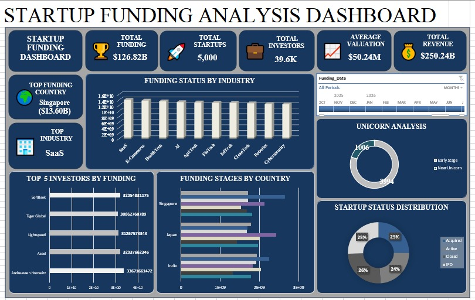

# startup-funding-analysis-dashboard
An interactive Microsoft Excel dashboard designed to analyze startup funding trends using Pivot Tables, Pivot Charts, KPIs, Slicers, and data visualization.

---

## 📌 Project Overview

This project analyzes startup funding data to identify investment trends, top-performing industries, funding stages, cities, and investors. The dashboard provides interactive insights for business analysis and decision-making.

---

## 🎯 Objectives

- Analyze startup funding trends
- Identify top-funded industries
- Compare funding across cities
- Monitor funding stages
- Create an interactive Excel dashboard using Pivot Tables and Charts

---

## 🛠️ Tools & Technologies

- Microsoft Excel
- Pivot Tables
- Pivot Charts
- Slicers
- Conditional Formatting
- Data Cleaning
- KPI Cards

---

## 📈 Dashboard KPIs

- 💰 Total Funding
- 🚀 Total Startups
- 📊 Average Funding
- 🏙️ Top Funding City
- 🏭 Top Industry

---

## 📊 Dashboard Preview

---

## 📑 Pivot Table Analysis

---

## 📂 Dataset

- Startup_Funding_Analysis_5000_Rows.xlsx

---

## 📌 Key Insights

- Identified industries receiving the highest investments.
- Compared funding across different cities.
- Analyzed funding stages of startups.
- Built interactive charts with slicers.
- Created KPI cards for quick business insights.

---

## 📁 Project Files

- 📄 Startup_Funding_Analysis_5000_Rows.xlsx
- 📄 Dashboard.jpeg
- 📄 Pivot Table.jpeg
- 📄 Raw Data.jpeg

---

## 👩‍💻 Author

*Revati Bandgar*

Aspiring Data Analyst | Excel | SQL | Power BI | Python

